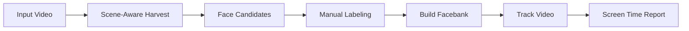

<!-- Improved compatibility of back to top link: See: https://github.com/othneildrew/Best-README-Template/pull/73 -->
<a id="readme-top"></a>

<!-- PROJECT SHIELDS -->
[![Contributors][contributors-shield]][contributors-url]
[![Forks][forks-shield]][forks-url]
[![Stargazers][stars-shield]][stars-url]
[![Issues][issues-shield]][issues-url]
[![MIT License][license-shield]][license-url]

<!-- PROJECT LOGO -->
<br />
<div align="center">
  <h1 align="center">Screen Time Analyzer</h1>

  <p align="center">
    Automated face detection, tracking, and screen time measurement for video content
    <br />
    <a href="#usage"><strong>Explore the docs »</strong></a>
    <br />
    <br />
    <a href="#usage">View Demo</a>
    ·
    <a href="https://github.com/yourusername/screen-time-analyzer/issues/new?labels=bug">Report Bug</a>
    ·
    <a href="https://github.com/yourusername/screen-time-analyzer/issues/new?labels=enhancement">Request Feature</a>
  </p>
</div>

<!-- TABLE OF CONTENTS -->
<details>
  <summary>Table of Contents</summary>
  <ol>
    <li>
      <a href="#about-the-project">About The Project</a>
      <ul>
        <li><a href="#built-with">Built With</a></li>
        <li><a href="#key-features">Key Features</a></li>
      </ul>
    </li>
    <li>
      <a href="#getting-started">Getting Started</a>
      <ul>
        <li><a href="#prerequisites">Prerequisites</a></li>
        <li><a href="#installation">Installation</a></li>
      </ul>
    </li>
    <li><a href="#usage">Usage</a></li>
    <li><a href="#workflow">Workflow</a></li>
    <li><a href="#configuration">Configuration</a></li>
    <li><a href="#roadmap">Roadmap</a></li>
    <li><a href="#contributing">Contributing</a></li>
    <li><a href="#license">License</a></li>
    <li><a href="#contact">Contact</a></li>
    <li><a href="#acknowledgments">Acknowledgments</a></li>
  </ol>
</details>

<!-- ABOUT THE PROJECT -->
## About The Project

Screen Time Analyzer is a comprehensive Python-based toolkit for automated face detection, person tracking, and screen time measurement in video content. Originally designed for analyzing reality TV shows, it provides accurate per-person screen time metrics using state-of-the-art computer vision and face recognition techniques.

**Perfect for:**
- Reality TV producers tracking cast screen time
- Content analysts measuring on-screen presence
- Media researchers studying character appearances
- Video editors needing automated person detection

<p align="right">(<a href="#readme-top">back to top</a>)</p>

### Built With

* [![Python][Python.org]][Python-url]
* [![OpenCV][OpenCV.org]][OpenCV-url]
* [![PyTorch][PyTorch.org]][PyTorch-url]
* [![ONNX][ONNX.ai]][ONNX-url]

<p align="right">(<a href="#readme-top">back to top</a>)</p>

### Key Features

- **Scene-Aware Face Harvesting**: Intelligently samples faces from every scene to ensure complete cast coverage
- **High-Accuracy Face Recognition**: Uses ArcFace embeddings for robust identity matching
- **Multi-Person Tracking**: Leverages ByteTrack and YOLOv8 for reliable person tracking across cuts and occlusions
- **Hardware Acceleration**: Supports CoreML (Mac), CUDA (NVIDIA), and CPU execution
- **Quality Filtering**: Automatic rejection of blurry, profile, or low-quality face samples
- **Flexible Configuration**: YAML-based settings for fine-tuning detection and tracking parameters
- **Visualization Tools**: Generate timeline plots and screen time reports

<p align="right">(<a href="#readme-top">back to top</a>)</p>

<!-- GETTING STARTED -->
## Getting Started

Follow these steps to set up Screen Time Analyzer on your local machine.

### Prerequisites

* Python 3.9 or higher
* FFmpeg
  ```sh
  # macOS
  brew install ffmpeg
  
  # Ubuntu/Debian
  sudo apt install ffmpeg
  
  # Windows
  # Download from https://ffmpeg.org/download.html
  ```

### Installation

1. Clone the repository
   ```sh
   git clone https://github.com/yourusername/screen-time-analyzer.git
   cd screen-time-analyzer
   ```

2. Create and activate a virtual environment
   ```sh
   python3 -m venv .venv
   source .venv/bin/activate  # On Windows: .venv\Scripts\activate
   ```

3. Install required packages
   ```sh
   pip install -r requirements.txt
   ```

4. Download YOLO weights
   ```sh
   mkdir -p models/weights
   # YOLOv8n weights will be downloaded automatically on first run
   ```

5. Install InsightFace models (automatic on first run)
   ```python
   # Models will be downloaded to ~/.insightface/ on first execution
   ```

<p align="right">(<a href="#readme-top">back to top</a>)</p>

<!-- USAGE EXAMPLES -->
## Usage

### Quick Start: 3-Step Workflow

#### 1. Harvest Face Candidates (Scene-Aware)

Extract face crops from your video using scene detection:

```sh
python scripts/harvest_faces.py \
    data/my_video.mp4 \
    --scene-aware \
    --scene-threshold 27.0 \
    --scene-samples 3 \
    --output-dir data/harvest \
    --fast
```

**Output:** `data/harvest/my_video/candidates/` containing face crops grouped by scene

#### 2. Build Facebank

Manually label the best face crops for each person, then build the facebank:

```sh
# Organize labeled faces
data/facebank/
├── person_name_1/
│   ├── photo1.jpg
│   ├── photo2.jpg
│   └── photo3.jpg
├── person_name_2/
│   ├── photo1.jpg
│   └── photo2.jpg

# Build facebank
python scripts/build_facebank.py \
    --facebank-root data/facebank \
    --output data/facebank.parquet
```

#### 3. Track and Measure Screen Time

Run tracking on the full video using your facebank:

```sh
python scripts/track_video.py \
    data/my_video.mp4 \
    --facebank data/facebank.parquet \
    --output-dir results/my_video \
    --visualize
```

**Output:**
- `results/my_video/tracking.csv` - Frame-by-frame tracking data
- `results/my_video/screen_time.csv` - Per-person screen time summary
- `results/my_video/timeline.png` - Visual timeline plot

<p align="right">(<a href="#readme-top">back to top</a>)</p>

## Workflow



### Detailed Steps

1. **Harvest Phase**: Extract face candidates from every scene
   - Scene detection automatically splits video into shots
   - Samples 3 frames per scene for efficiency
   - Filters out low-quality faces (blurry, too small, extreme angles)

2. **Labeling Phase**: Create ground truth identities
   - Review candidates and pick 8-12 best samples per person
   - Organize into `data/facebank/<person_name>/`
   - Include variety of angles, expressions, and lighting

3. **Facebank Phase**: Generate face embeddings
   - Compute ArcFace embeddings for all labeled faces
   - Store in efficient Parquet format
   - Used as reference for tracking

4. **Tracking Phase**: Identify people in full video
   - Person detection (YOLOv8) + face detection (RetinaFace)
   - ByteTrack maintains identities across frames
   - Face recognition matches against facebank
   - Handles occlusions, cutaways, and multiple people

5. **Analysis Phase**: Generate reports and visualizations
   - Per-person screen time summaries
   - Timeline visualizations
   - Exportable CSV data for further analysis

<p align="right">(<a href="#readme-top">back to top</a>)</p>

## Configuration

### Main Configuration Files

```
configs/
├── pipeline.yaml      # Detection, tracking, and recognition settings
├── bytetrack.yaml     # Person tracking parameters
└── harvest.yaml       # Face harvesting settings (optional)
```

### Key Parameters

**Detection Settings** (`pipeline.yaml`):
```yaml
# Face detection
face_conf_th: 0.30              # Minimum confidence for face detection
det_size: [960, 960]            # RetinaFace resolution

# Person detection  
person_conf_th: 0.10            # Minimum confidence for person detection

# Quality filtering
min_sharpness_laplacian: 30.0   # Reject blurry faces
min_frontalness: 0.15           # Reject extreme profiles
```

**Tracking Settings** (`bytetrack.yaml`):
```yaml
track_buffer: 600               # Keep tracks alive for ~25 seconds
match_thresh: 0.75              # IoU threshold for track matching
```

**Scene-Aware Harvesting**:
```sh
--scene-threshold 27.0          # Scene change sensitivity (lower = more scenes)
--scene-samples 3               # Frames to sample per scene
--min-face-frac 0.02           # Minimum face size (2% of frame)
```

<p align="right">(<a href="#readme-top">back to top</a>)</p>

## Roadmap

- [x] Scene-aware face harvesting
- [x] CoreML acceleration for Mac
- [x] Multi-person tracking with ByteTrack
- [ ] GPU batch processing for faster embedding
- [ ] Web UI for labeling and reviewing results
- [ ] Automated quality assessment for harvested faces
- [ ] Export to video editing software (FCP XML, Premiere)
- [ ] Real-time processing mode
- [ ] Docker containerization

See the [open issues](https://github.com/yourusername/screen-time-analyzer/issues) for a full list of proposed features and known issues.

<p align="right">(<a href="#readme-top">back to top</a>)</p>

## Contributing

Contributions are what make the open source community such an amazing place to learn, inspire, and create. Any contributions you make are **greatly appreciated**.

If you have a suggestion that would make this better, please fork the repo and create a pull request. You can also simply open an issue with the tag "enhancement".

1. Fork the Project
2. Create your Feature Branch (`git checkout -b feature/AmazingFeature`)
3. Commit your Changes (`git commit -m 'Add some AmazingFeature'`)
4. Push to the Branch (`git push origin feature/AmazingFeature`)
5. Open a Pull Request

<p align="right">(<a href="#readme-top">back to top</a>)</p>

## License

Distributed under the MIT License. See `LICENSE.txt` for more information.

<p align="right">(<a href="#readme-top">back to top</a>)</p>

## Contact

Your Name - [@your_twitter](https://twitter.com/your_twitter) - email@example.com

Project Link: [https://github.com/yourusername/screen-time-analyzer](https://github.com/yourusername/screen-time-analyzer)

<p align="right">(<a href="#readme-top">back to top</a>)</p>

## Acknowledgments

* [InsightFace](https://github.com/deepinsight/insightface) - RetinaFace detection and ArcFace recognition
* [Ultralytics YOLOv8](https://github.com/ultralytics/ultralytics) - Person detection
* [ByteTrack](https://github.com/ifzhang/ByteTrack) - Multi-object tracking
* [PySceneDetect](https://github.com/Breakthrough/PySceneDetect) - Scene boundary detection
* [ONNX Runtime](https://onnxruntime.ai/) - Cross-platform inference optimization

<p align="right">(<a href="#readme-top">back to top</a>)</p>

<!-- MARKDOWN LINKS & IMAGES -->
[contributors-shield]: https://img.shields.io/github/contributors/yourusername/screen-time-analyzer.svg?style=for-the-badge
[contributors-url]: https://github.com/yourusername/screen-time-analyzer/graphs/contributors
[forks-shield]: https://img.shields.io/github/forks/yourusername/screen-time-analyzer.svg?style=for-the-badge
[forks-url]: https://github.com/yourusername/screen-time-analyzer/network/members
[stars-shield]: https://img.shields.io/github/stars/yourusername/screen-time-analyzer.svg?style=for-the-badge
[stars-url]: https://github.com/yourusername/screen-time-analyzer/stargazers
[issues-shield]: https://img.shields.io/github/issues/yourusername/screen-time-analyzer.svg?style=for-the-badge
[issues-url]: https://github.com/yourusername/screen-time-analyzer/issues
[license-shield]: https://img.shields.io/github/license/yourusername/screen-time-analyzer.svg?style=for-the-badge
[license-url]: https://github.com/yourusername/screen-time-analyzer/blob/master/LICENSE.txt

[Python.org]: https://img.shields.io/badge/Python-3776AB?style=for-the-badge&logo=python&logoColor=white
[Python-url]: https://python.org/
[OpenCV.org]: https://img.shields.io/badge/OpenCV-5C3EE8?style=for-the-badge&logo=opencv&logoColor=white
[OpenCV-url]: https://opencv.org/
[PyTorch.org]: https://img.shields.io/badge/PyTorch-EE4C2C?style=for-the-badge&logo=pytorch&logoColor=white
[PyTorch-url]: https://pytorch.org/
[ONNX.ai]: https://img.shields.io/badge/ONNX-005CED?style=for-the-badge&logo=onnx&logoColor=white
[ONNX-url]: https://onnx.ai/
